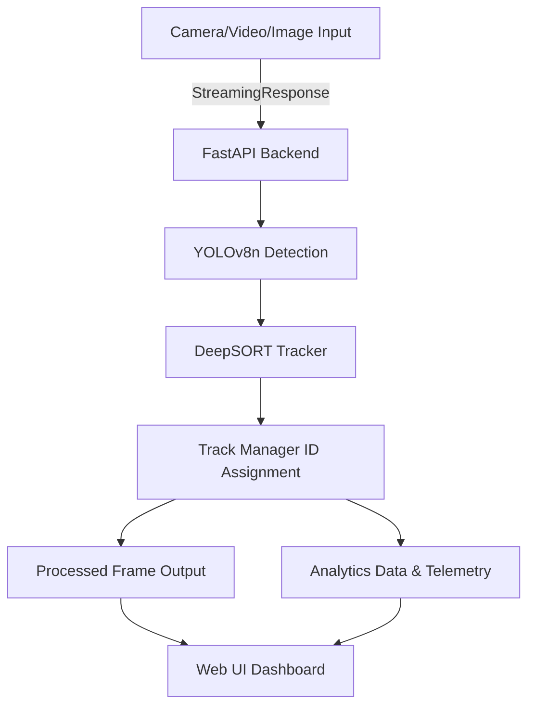

# AutoTrack AI

## Project Overview
AutoTrack AI is a lightweight Multi-Object Tracking system designed to identify and track vehicles and pedestrians across video frames. It assigns a unique tracking ID to each tracked object, maintaining its identity over time, while executing efficiently on low-end hardware (CPU only). 

The system simulates a modern traffic-monitoring and autonomous driving perception module, deployed through an interactive web interface.

## YOLO Detection
We use **YOLOv8n** (nano version) to detect objects in the scene. YOLOv8 is chosen due to its balance of speed and accuracy. The nano model ensures fast inference speed, making it explicitly suited for low-end, CPU-only edge performance. The system filters for specific object classes important to traffic monitoring: cars, trucks, buses, motorcycles, and persons.

## DeepSORT Tracking
To transform isolated detections into contiguous object tracks, the system integrates **DeepSORT**. DeepSORT algorithm maintains object identity across frames, assigns unique IDs based on overlapping bounds, predicts future positions using the Kalman filter, and assigns tracking identities utilizing cosine distance thresholds to help prevent ID switching.

## System Architecture


## Optimization Techniques
To operate optimally on an 8GB RAM CPU logic platform:
- **Frame Skipping:** The tracking engine only processes every 2nd frame.
- **Resolution Scaling:** Frames are scaled before feeding into the inference engine.
- **`torch.no_grad()` & `.eval()`:** Model inference applies these directives to disable gradients caching, drastically reducing RAM footprints.
- **Efficient Processing:** Direct streaming logic without buffering whole videos.

## Installation
1. Clone the repository:
```bash
git clone https://github.com/your-username/autotrack_ai.git
cd autotrack_ai
```
2. Set up a virtual environment (optional but recommended):
```bash
python -m venv venv
venv\Scripts\activate
```
3. Install dependencies:
```bash
pip install -r requirements.txt
```

## Running the Application
To run the server locally:
```bash
cd backend
uvicorn main:app --reload
```
Navigate your browser to `http://localhost:8000`.

## Resume-ready Description
**Multi-Object Vehicle & Pedestrian Tracking System**
Built a real-time tracking application using YOLOv8n and DeepSORT for CPU-only execution under strict performance optimization constraints. Implemented frame-skipping, dynamic model evaluation rendering (`torch.no_grad()`), and FastAPIs's streaming abstractions. Deployed it directly to a responsive, custom-styled frontend GUI resembling a cutting-edge autonomous driving perception HUD.
